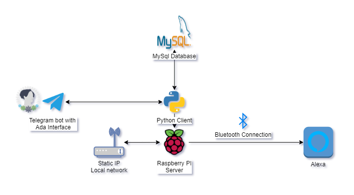

<div align="center">
  <div align="center">
      
  </div>
  <h3 align="center">ADA (Home Bot)</h3>
  <p>A simple bot with a crypto module in bitso</p>
  <p align="center">
    <a href="https://github.com/eocode/Queens/blob/master/LICENSE" target="__blank">
      	
    </a>
    <a href="https://github.com/ambv/black" target="__blank">
        
    </a>
    
  </p>
</div>

## Features
* Bitso API
  * Smart alerts
  * Commission calculation
  * Simulations
  * Monitors
* Telegram messages by users
* Speak messages
* RaspberryPI compatibility connected by bluetoth with Alexa

### Require

* Python 3.7 +
* RaspberryPi 3 +
* Alexa
* Telegram Bot
* Static IP and Router configuration

## Support

* Windows
* Linux

## Architecture

<div align="center">
    
</div>

### Install and run

``pip install -r requirements.txt``

``python main.py``

#### Env file

In root directory create a .env file with:

```
# MySQL Credentials
DB_USER='your user'
DB_PASS='your pass'
DB_NAME='your name'
DB_HOST='your host'

# Telegram access
telegram_users = 'string separated with comma' 
telegram_token_bot = 'your token'

# Bot settings
bot_name = 'bot_name'
```

## Contribution

Contribute to make the best virtual assistant bot for raspberry pi and python

* Contact me @eocode in social media
* See the issue list
* Clone this project and add your contributions
* Send me a pull request

## LICENSE 

GNU GENERAL PUBLIC LICENSE

Version 3, 29 June 2007

https://github.com/eocode/Ada-Bot/blob/main/LICENSE